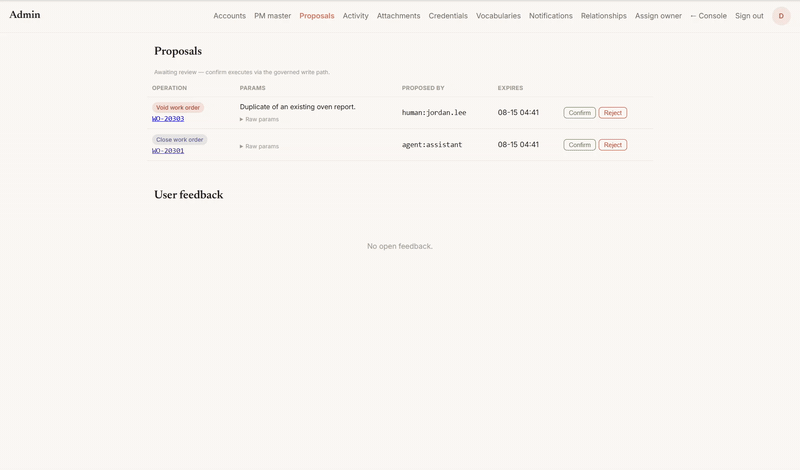

# Shopfloor CMMS

A production maintenance management system for a manufacturing plant — rebuilt from a legacy
commercial CMMS, with an LLM agent wired in under a hard governance boundary.

**The agent can read anything in this system. It can write nothing.**
Every action an agent takes lands as a *proposal* that a human confirms.



*Above: the agent has proposed closing a work order. It waits in `/admin/proposals` until a human
confirms — and the audit trail records the confirmation against the admin, not the agent.*

---

## Why this exists

The plant ran maintenance on eMaint X4. Work orders got opened, work got done, work orders got
closed — and the numbers that came out the other end were not believable. A machine would show
40 hours of downtime in a month because a work order sat open across a weekend the line was not
scheduled to run. Nobody trusted the report, so nobody used the report, so the CMMS was a filing
cabinet with a login.

This is the replacement. It is in production: engineers file breakdowns from their phones,
operators scan a barcode on the machine, preventive maintenance generates itself on schedule, and
the downtime engine knows the difference between "broken" and "not scheduled to run."

The part worth reading, though, is not the CRUD. It is
[what happens when you let a language model near a system of record](docs/ARCHITECTURE.md).

## Demo

```bash
docker compose up
# then: http://localhost:8000/app   (see docs/DEMO.md for credentials + a guided tour)
```

The demo comes up on a synthetic dataset generated by `scripts/generate_demo_data.py`. **No
production records ship in this repository** — not one work order, machine, person or part from the
real plant — and none ever will. The figures under
[Scale it handles](#scale-it-handles) describe the migration and the production deployment; they
are not data included here. See [About this copy](#about-this-copy).

---

## The governance model

This is the spine of the project. Four rules, enforced in the domain layer, not in the prompt:

1. **Single write path.** Every mutation goes through a domain service. The MCP tools, the CLI, the
   web routes, the scheduler and the agent all call the same functions. Nothing gets raw SQL — not
   even the agent's tools.
2. **MCP tools are domain operations, not database access.** The agent is handed
   `close_work_order` and `list_due_pm_schedules`, never `run_sql` or `update_table`. There is no
   tool that can express an unbounded write, so there is no prompt that can trick one out of it.
3. **Gated writes.** An agent-originated mutation is not a mutation. It is a `pending_proposal`
   row, with a dry-run diff, that an authenticated human admin must confirm. Confirmation
   re-validates from scratch and does not trust the proposal payload
   ([ADR-016](docs/ARCHITECTURE.md)).
4. **Everything is audited.** Who, when, what, why — and a `source_actor` that distinguishes
   `human:<id>` from `agent:<name>` from `mes-pipeline` from `scheduler`. You can always answer
   "did a person do this, or did a model?"

Two consequences that fell out of taking this seriously:

- **The agent cannot confirm its own proposal.** An early adversarial review found that a tool
  caller could mint an arbitrary "human" actor string and confirm its own write. Identity is now
  bound to the transport, not to a parameter ([ADR-020](docs/ARCHITECTURE.md)).
- **The agent is pluggable, the governance is not.** The web console talks to a gateway; the
  gateway happens to run one model today. Swapping the model changes nothing about who is allowed
  to write what.

## What's in it

| | |
|---|---|
| **Work orders** | Canonical 7-state machine, full `status_history`, downtime engine that is aware of the production calendar and of work type (a PM work order sitting in `OPEN` is not downtime; a breakdown is) |
| **Assets** | 687-asset hierarchy with typed relationships — containment (machine ⊃ module) and shared dependency (one shared subsystem serving three machines), which is the difference between a tree and the truth |
| **Preventive maintenance** | Schedules, task templates with per-step parts, on-demand and unattended generation, calendar view |
| **Inventory** | Spare parts, stock transactions, part issues charged to a work order *or* directly to a machine, controlled storage-bin vocabulary |
| **Procurement** | Supplier contacts, reorder points, batch RFQ by email |
| **Field surface** | Mobile-first console: barcode scan → photo → breakdown filed in under 30 seconds. Trilingual (EN / 中文 / Tiếng Việt) |
| **Agent surface** | MCP server (25 domain tools), an in-app assistant, and a Telegram bot — all through the same gated write path |
| **Integrations** | Jira (work orders forwarded into a maintenance ticket, notes synced as comments), Cloudflare R2 for media, SMTP + Telegram for notifications |
| **Governance surface** | Admin console: proposal review, audit feed, credential vault, controlled vocabularies, RBAC (admin / engineer / operator) |

The **operator** role is a good example of the domain doing the work: an operator can open a
breakdown and cancel their own mistake, and that is all. They cannot close a work order — they are
not the ones who decide the machine is fixed. That rule lives in the domain service, so it holds
whether the request came from the web form, the CLI, or a language model.

## Scale it handles

Migrated from the legacy system and running in production. These numbers describe the *migration*
— **none of that data is in this repository**:

- **21,513** work orders (history preserved, with a reconstructed status timeline)
- **687** assets · **984** PM schedules · **1,332** spare parts · **212** suppliers
- **1,042** photos, content-addressed in object storage

## Stack

Python 3.12 · FastAPI · SQLAlchemy 2 (async) · Alembic · Pydantic v2 · PostgreSQL 17 ·
Jinja2 + HTMX + hand-written CSS (no build step) · official MCP SDK · pytest + testcontainers ·
ruff · Docker on Fly.io

**909 tests · 35 migrations · 27 ADRs.**

## Repo map

```
src/cmms/
  domain/        the only thing allowed to write. one package per aggregate.
  api/           read-only JSON contracts for downstream consumers (bearer-authed)
  mcp/           MCP server — domain operations exposed as agent tools
  web/           server-rendered console (Jinja2 + HTMX), i18n, static assets
  cli/           operator + loader commands
migrations/      alembic, 0001 → 0035
infra/           Dockerfiles + fly.toml for app, postgres, backup, agent gateway
docs/            ↓
tests/           unit (pure transforms) + integration (real postgres via testcontainers)
```

> **A note on the code comments.** Inline comments and docstrings are in Traditional Chinese — the
> working language of the plant this was built for, and of the engineer who has to maintain it at
> 2am. Everything a reader needs is in English: the README, all 27 ADRs, and the domain model.

## Docs

Read in this order:

- **[ARCHITECTURE.md](docs/ARCHITECTURE.md)** — 27 ADRs. The decisions and, more usefully, the
  ones that were wrong and got superseded. If you read one thing, read ADR-016 (gated writes),
  ADR-020 (agent gateway) and ADR-027 (the agent constitution).
- **[REQUIREMENTS.md](docs/REQUIREMENTS.md)** — scope, and what was deliberately left out.
- **[domain-model/](docs/domain-model/)** — the entity models, field by field, including the parts
  of the legacy data that were ambiguous and how that ambiguity was resolved rather than guessed.
- **[EXECUTION-PLAYBOOK.md](docs/EXECUTION-PLAYBOOK.md)** — how this was actually built with AI
  agents: model routing, stop-work signals, quality gates, and a catalogue of the failure modes
  that cost the most time.
- **[DEMO.md](docs/DEMO.md)** — bring it up locally and click the interesting parts.

## How it was built

By one process/equipment engineer, with AI assistance, over about six weeks.

That is worth being precise about, because "AI wrote it" is not the interesting claim. The
bottleneck was never producing code. The bottleneck was deciding what the system was allowed to do:
what a status transition means, whether a PM work order in `OPEN` counts as downtime, whether an
operator may close a ticket, what an agent may write without a human in the loop. Those decisions
are what the ADRs are, and they are the part no model made.

The mechanics — model routing, adversarial review passes, the quality gates that had to pass before
anything shipped, and the failure modes that showed up repeatedly — are written up in
[EXECUTION-PLAYBOOK.md](docs/EXECUTION-PLAYBOOK.md).

## About this copy

This is a **sanitised public snapshot** of a system that runs in a real factory.

- The plant, its people, its contractors, its suppliers and its machines are **fictional throughout** —
  every name, code name, hostname and identifier here is invented. Third-party products the system
  actually integrates with (PostgreSQL, Fly.io, Cloudflare R2, Jira, Telegram, and the commercial CMMS
  this replaced) are named as themselves, because the engineering would be unreadable otherwise.
- **No production records ship here.** The demo runs on a generated synthetic dataset; the
  migration figures above are counts, not contents. Where a document needed a concrete example, it
  uses a synthetic one.
- Deployment configuration is templated; no secrets, no endpoints.

Published with my employer's agreement. The code and the architecture are mine; the plant's data
is not, and it is not here.

## License

MIT — see [LICENSE](LICENSE).
